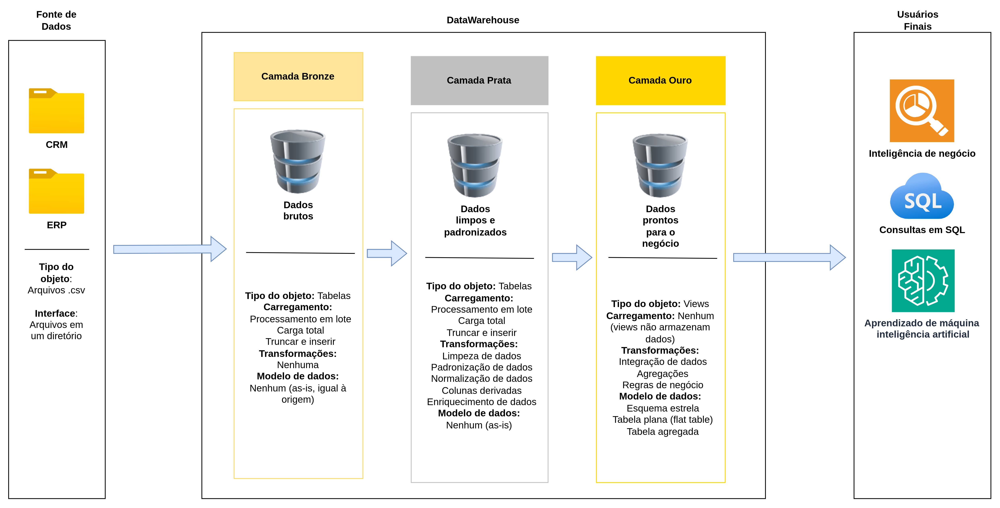
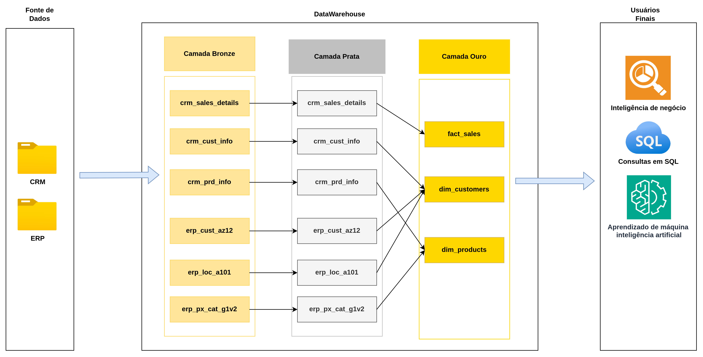
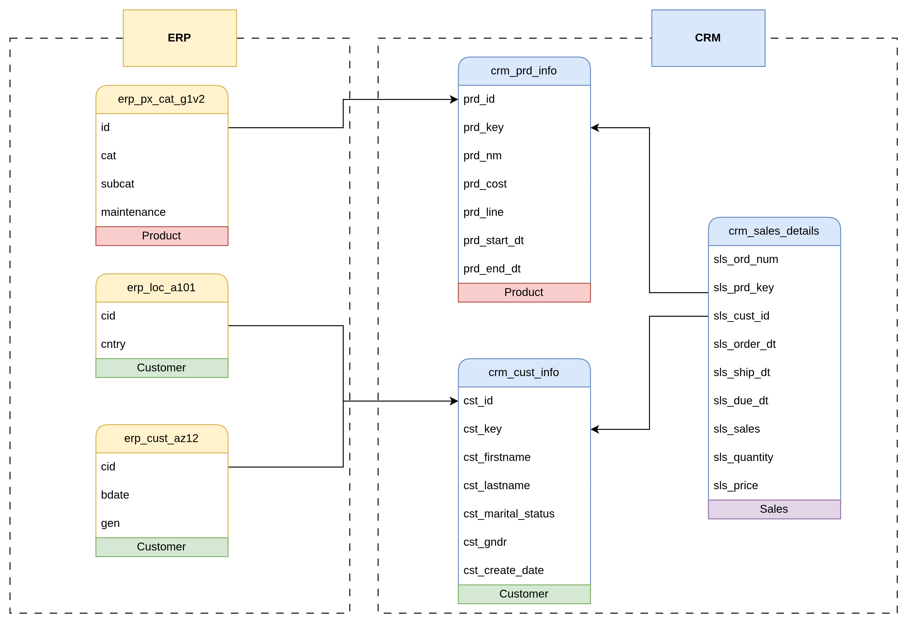
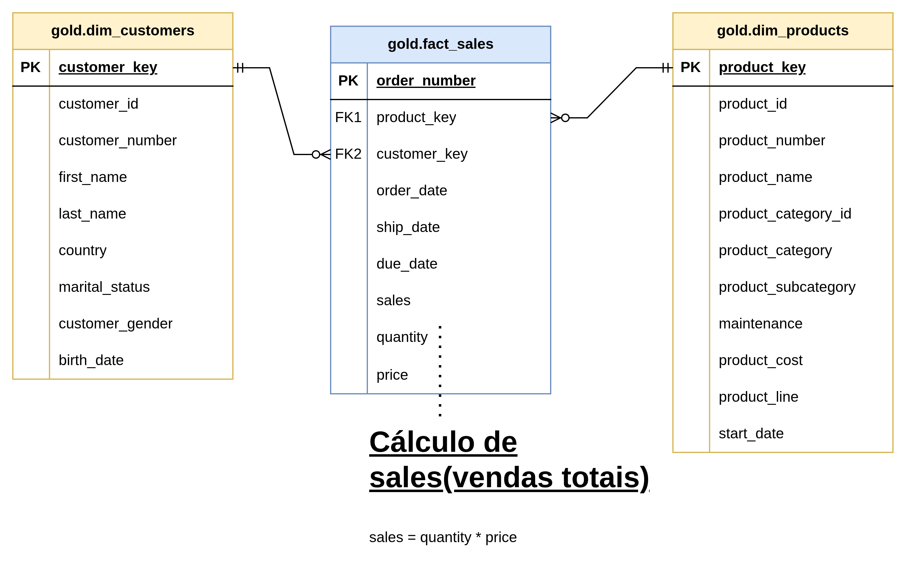

# Projeto de Data Warehouse e Analytics

Bem-vindo ao repositório do **Projeto de Data Warehouse e Analytics**! 🚀
Este projeto constrói um data warehouse completo em SQL, desde a ingestão dos dados brutos até um modelo pronto para análise. Foi desenvolvido durante a **Capacitação 03 – SQL para Data Warehouse** do Trainee do Núcleo de Dados (NDados) da EESC jr., seguindo o tutorial [SQL Data Warehouse from Scratch | Full Hands-On Data Engineering Project](https://www.youtube.com/watch?v=9GVqKuTVANE).

---

## 🏗️ Arquitetura de Dados

O projeto segue a **Arquitetura Medalhão**, com as camadas **Bronze**, **Prata (Silver)** e **Ouro (Gold)**:



1. **Camada Bronze**: armazena os dados brutos exatamente como vieram dos sistemas de origem. Os dados são carregados dos arquivos CSV para o banco PostgreSQL com `COPY`.
2. **Camada Prata**: faz a limpeza, padronização e normalização dos dados (remoção de duplicados, tratamento de nulos e datas inválidas, padronização de valores) para prepará-los para análise.
3. **Camada Ouro**: contém os dados prontos para o negócio, modelados em **esquema estrela** (star schema) por meio de views, voltados para relatórios e análises.

---

## 📖 Visão Geral do Projeto

O projeto envolve:

1. **Arquitetura de Dados**: desenho de um data warehouse moderno usando a Arquitetura Medalhão.
2. **Pipelines de ETL**: extração, transformação e carga dos dados dos sistemas de origem para o warehouse.
3. **Modelagem de Dados**: criação de tabelas de fatos e dimensões otimizadas para consultas analíticas.
4. **Analytics e Relatórios**: consultas SQL que geram insights para o negócio.

---

## 📥 Fontes de Dados

Os dados vêm de **dois sistemas de origem**, fornecidos como arquivos CSV:

- **CRM**: informações de clientes, produtos e detalhes das vendas.
- **ERP**: informações complementares de clientes (data de nascimento, gênero, país) e categorias de produtos.

---

## ⭐ Tabelas da Camada Ouro

| Objeto | Tipo | Descrição |
|---|---|---|
| `gold.dim_customers` | Dimensão | Clientes com dados integrados do CRM e do ERP |
| `gold.dim_products` | Dimensão | Produtos ativos com suas categorias e subcategorias |
| `gold.fact_sales` | Fato | Vendas, ligadas às dimensões por chaves substitutas (surrogate keys) |

---

## 🗺️ Diagramas

Todos os diagramas são editáveis em [`docs/diagramas.drawio`](docs/diagramas.drawio) (Draw.io, uma página por diagrama).

| Diagrama | Descrição |
|---|---|
|  | **Fluxo de dados:** como cada tabela de origem passa pelas camadas Bronze, Prata e Ouro até chegar às views finais. |
|  | **Integração das fontes:** como as tabelas do CRM e do ERP se relacionam entre si. |
|  | **Modelo de dados (esquema estrela):** `fact_sales` ligada a `dim_customers` e `dim_products` por chaves substitutas. |

---

## 📚 Documentação

- [Catálogo de dados](docs/catalogo-de-dados.md): descrição das views e colunas da camada Ouro.
- [Convenções de nomenclatura](docs/convencao-de-nomenclatura.md): regras de nomes de schemas, tabelas, colunas e procedures.

---

## 🛠️ Ferramentas Utilizadas

- **[PostgreSQL](https://www.postgresql.org/download/):** servidor de banco de dados usado no projeto.
- **Um cliente SQL** (ex.: [psql](https://www.postgresql.org/docs/current/app-psql.html), [pgAdmin](https://www.pgadmin.org/) ou [DBeaver](https://dbeaver.io/)): para conectar e executar os scripts no banco.
- **[GitHub](https://github.com/):** versionamento do código.
- **[Draw.io](https://www.drawio.com/):** diagramas de arquitetura, fluxo e modelo de dados.

---

## 🚀 Requisitos do Projeto

### Construção do Data Warehouse (Engenharia de Dados)

#### Objetivo
Desenvolver um data warehouse moderno em PostgreSQL para consolidar dados de vendas, permitindo relatórios analíticos e tomada de decisão embasada.

#### Especificações
- **Fontes de Dados**: importar dados de dois sistemas (ERP e CRM) fornecidos como CSV.
- **Qualidade dos Dados**: limpar e resolver problemas de qualidade antes da análise.
- **Integração**: combinar as duas fontes em um único modelo de dados, fácil de usar e voltado a consultas analíticas.
- **Escopo**: considerar apenas o conjunto de dados mais recente; não é necessário manter histórico.
- **Documentação**: documentar o modelo de dados de forma clara para as áreas de negócio e de análise.

### BI: Analytics e Relatórios (Análise de Dados)

#### Objetivo
Desenvolver análises em SQL que tragam insights sobre:
- **Comportamento dos clientes**
- **Desempenho dos produtos**
- **Tendências de vendas**

---

## 📂 Estrutura do Repositório

```
datawarehouse-project/
│
├── datasets/                           # Dados brutos usados no projeto (CRM e ERP)
│
├── docs/                               # Documentação e diagramas do projeto
│   ├── diagramas.drawio                # Diagramas editáveis (arquitetura, fluxo, integração e modelo de dados)
│   ├── arquitetura-dados.png           # Arquitetura de dados (imagem)
│   ├── fluxo-dados.png                 # Fluxo de dados entre as camadas (imagem)
│   ├── modelo-integracao-dados.png     # Integração entre as tabelas do CRM e do ERP (imagem)
│   ├── modelo-dados.png                # Modelo de dados em esquema estrela (imagem)
│   ├── catalogo-de-dados.md            # Catálogo de dados da camada Ouro
│   ├── convencao-de-nomenclatura.md    # Convenções de nomenclatura de tabelas, colunas e arquivos
│
├── scripts/                            # Scripts SQL de ETL, transformação e testes
│   ├── init_database.sql               # Criação do banco e dos schemas
│   ├── bronze/                         # DDL e procedure de carga da camada Bronze
│   ├── silver/                         # DDL e procedure de carga da camada Prata
│   ├── gold/                           # Views do modelo analítico (camada Ouro)
│   ├── tests/                          # Testes de qualidade das camadas Prata e Ouro
│
├── README.md                           # Visão geral do projeto
└── .gitignore                          # Arquivos ignorados pelo Git
```

---

## ✅ Status do Projeto

- [x] Criação do banco e dos schemas (`scripts/init_database.sql`)
- [x] DDL da camada Bronze (`scripts/bronze/ddl_bronze.sql`)
- [x] Procedure de carga da Bronze (`scripts/bronze/proc_load_bronze.sql` → `bronze.load_bronze`), testada e validada (18.494 + 397 + 60.398 + 18.484 + 18.484 + 37 linhas carregadas)
- [x] DDL da camada Prata (`scripts/silver/ddl_silver.sql`)
- [x] Procedure de carga da Prata (`scripts/silver/proc_load_silver.sql` → `silver.load_silver`), com mensagens de progresso, duração por etapa e tratamento de erro
- [x] Views da camada Ouro (`scripts/gold/ddl_gold.sql`: `gold.dim_customers`, `gold.dim_products`, `gold.fact_sales`)
- [x] Catálogo de dados (`docs/catalogo-de-dados.md`)
- [x] Diagramas de arquitetura, fluxo de dados, integração e modelo de dados (`docs/diagramas.drawio`)
- [x] Testes de qualidade da camada Prata (`scripts/tests/quality_check_silver.sql`): 44 testes de chaves, espaços, padronização, datas, consistência e integridade
- [x] Testes de qualidade da camada Ouro (`scripts/tests/quality_check_gold.sql`): 34 testes de chaves, padronização, datas, integridade referencial e reconciliação com a Prata
- [ ] Consultas de analytics e relatórios (comportamento de clientes, desempenho de produtos, tendências de vendas)

---

## ▶️ Como Executar

0. **Disponibilize os CSVs para o servidor PostgreSQL** (só é necessário no Linux; ver aviso abaixo):
   ```bash
   sudo mkdir -p /srv/datawarehouse-datasets
   sudo cp -r datasets/* /srv/datawarehouse-datasets/
   sudo chmod -R a+rX /srv/datawarehouse-datasets
   ```
1. Rode `scripts/init_database.sql`: primeiro a Parte 1, conectado ao banco `postgres`, para (re)criar o banco `datawarehouse`; depois a Parte 2, já conectado ao banco `datawarehouse`, para criar os schemas `bronze`, `silver` e `gold`.
2. Rode `scripts/bronze/ddl_bronze.sql` para criar as tabelas da Bronze e carregue os dados com `CALL bronze.load_bronze();`
3. Rode `scripts/silver/ddl_silver.sql` para criar as tabelas da Prata, rode `scripts/silver/proc_load_silver.sql` para criar a procedure e carregue os dados com `CALL silver.load_silver();`
4. Rode `scripts/gold/ddl_gold.sql` para criar as views da camada Ouro.
5. Rode os testes de qualidade, todos os testes devem aparecer como `OK`:
   - `scripts/tests/quality_check_silver.sql` (camada Prata, depois do passo 3);
   - `scripts/tests/quality_check_gold.sql` (camada Ouro, depois do passo 4).

> ⚠️ O parâmetro `p_caminho_base` de `bronze.load_bronze` deve apontar para uma pasta no computador onde o **servidor** PostgreSQL está rodando (o `COPY` é executado pelo servidor, não pelo cliente) — o padrão é `/srv/datawarehouse-datasets` (passo 0 acima). Em muitas distros Linux, o serviço `postgresql` roda com o hardening `ProtectHome=true` do systemd, que torna `/home` inteiro invisível para o processo do servidor mesmo com as permissões de arquivo corretas — por isso os CSVs precisam estar fora de `/home` (e não dentro de `datasets/` no próprio repositório). Ajuste o valor padrão em `proc_load_bronze.sql` ou passe o caminho na chamada, ex.: `CALL bronze.load_bronze('/caminho/para/datasets');`

---

## 🙏 Créditos

Projeto baseado no tutorial gratuito de **Baraa Khatib Salkini ([Data With Baraa](https://www.youtube.com/@datawithbaraa))**. Repositório original: [DataWithBaraa/sql-data-warehouse-project](https://github.com/DataWithBaraa/sql-data-warehouse-project).

## 👤 Autor

**Renan Correia Monteiro Soares** – Trainee 2026.2 do Núcleo de Dados da EESC jr.
[LinkedIn](https://www.linkedin.com/in/renan-correia-064a36209/) · [GitHub](https://github.com/reniba)